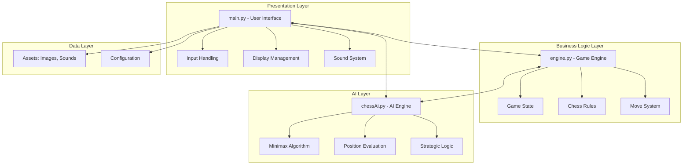
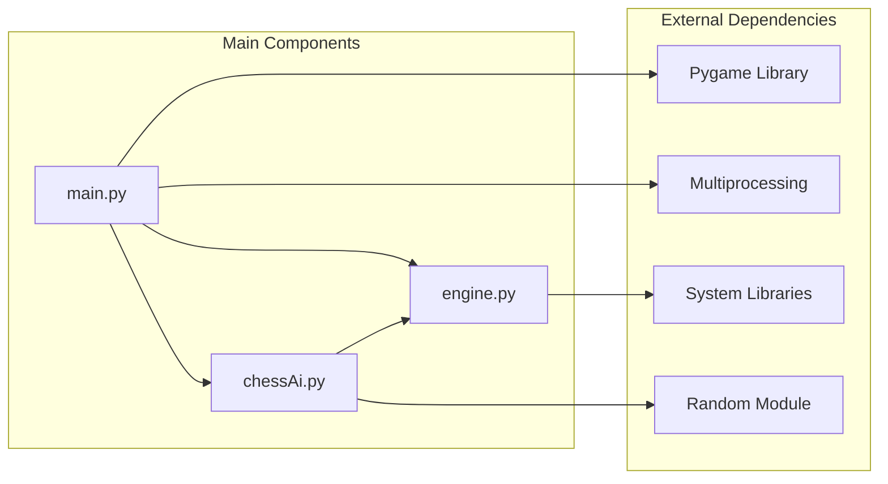
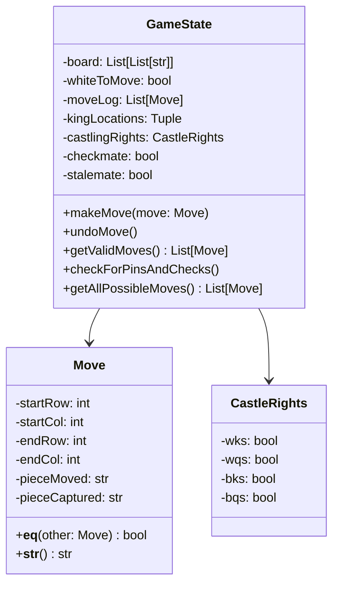
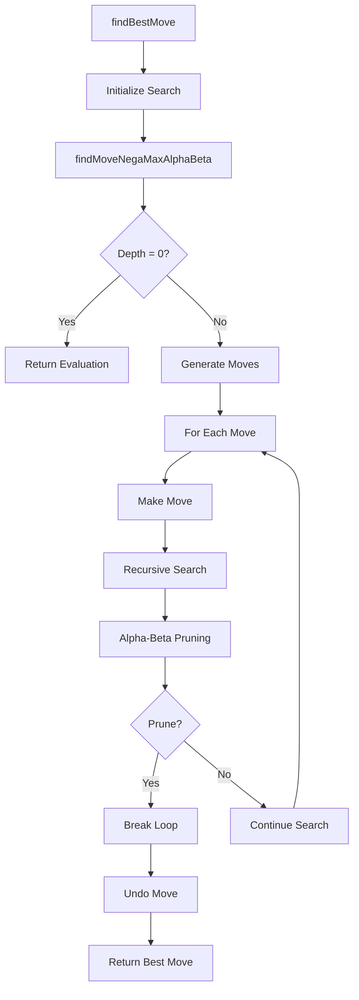
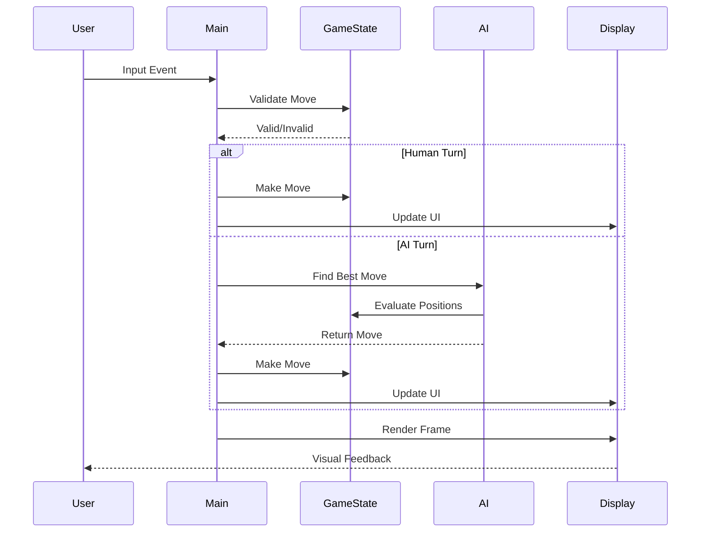
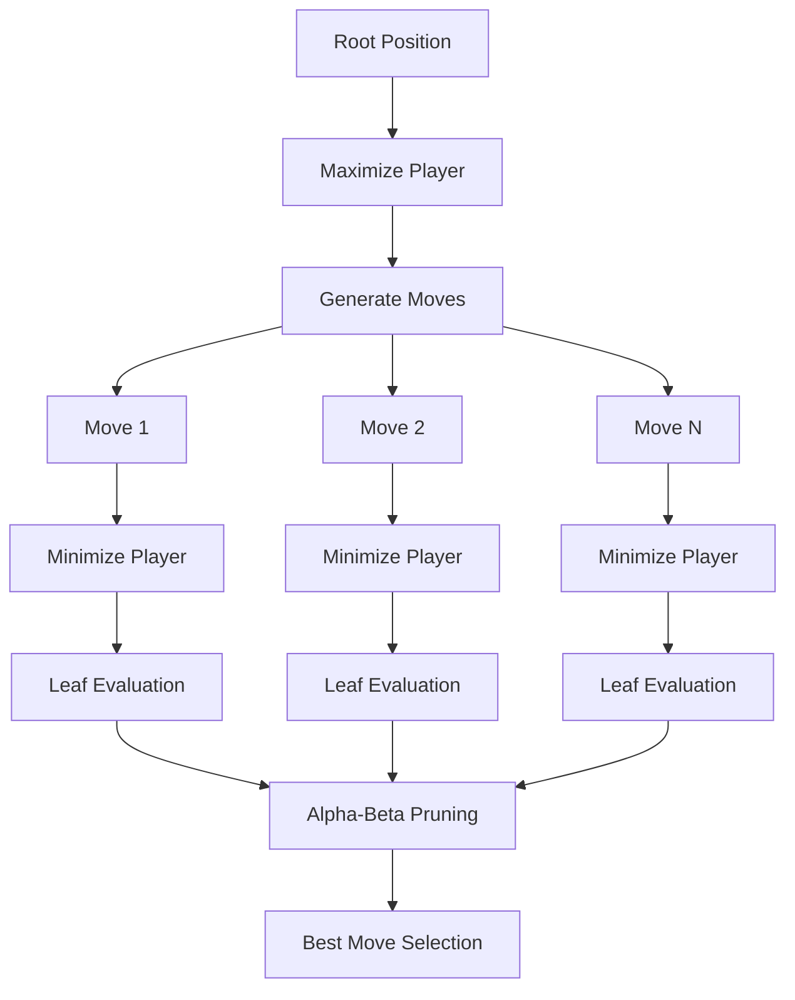
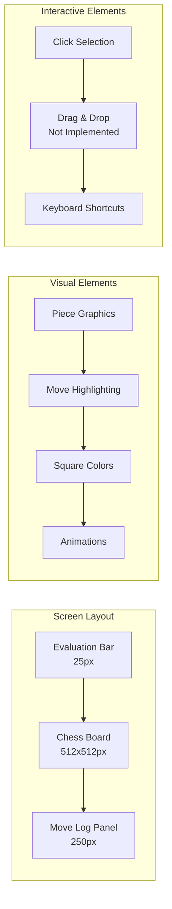
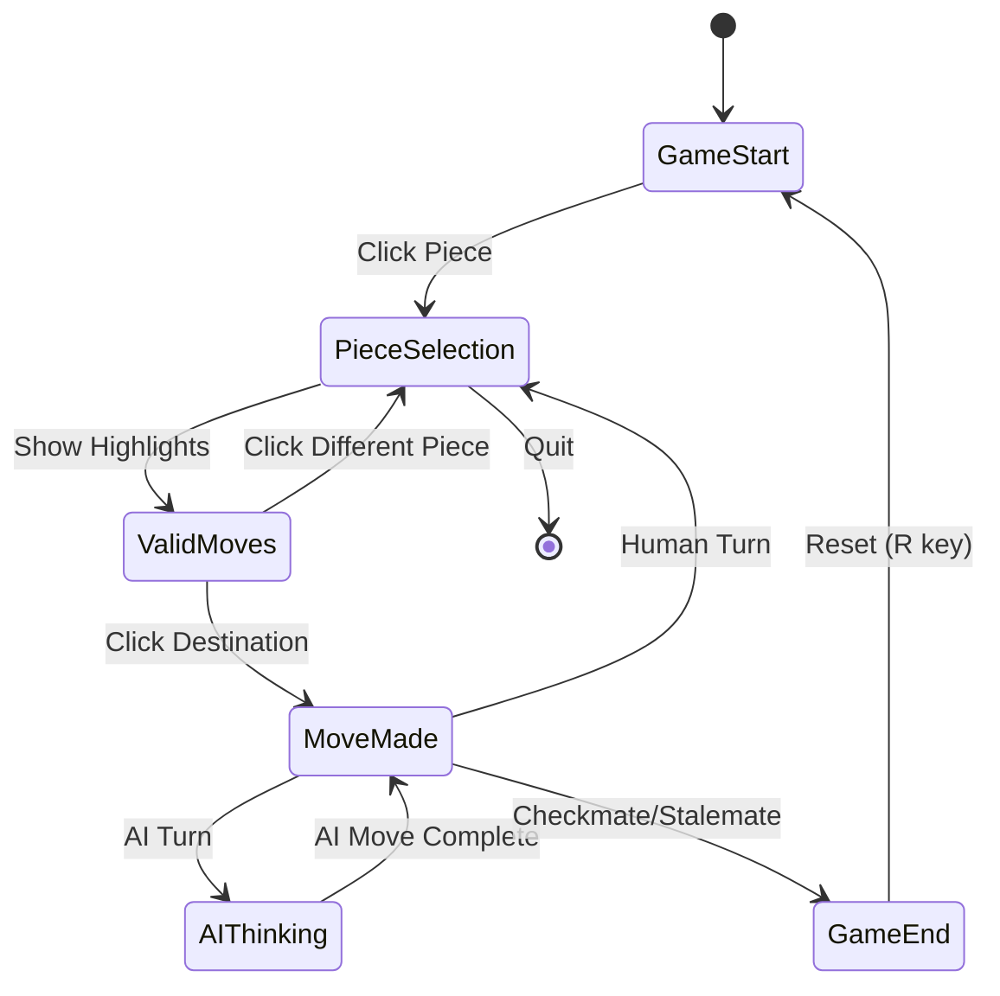

# Chess Game Codebase Analysis

## Table of Contents
1. [Executive Summary](#executive-summary)
2. [Product Overview](#product-overview)
3. [Architecture Analysis](#architecture-analysis)
4. [Technical Deep Dive](#technical-deep-dive)
5. [Code Quality Assessment](#code-quality-assessment)
6. [AI Implementation Analysis](#ai-implementation-analysis)
7. [User Experience Analysis](#user-experience-analysis)
8. [Performance Considerations](#performance-considerations)
9. [Security and Robustness](#security-and-robustness)
10. [Future Enhancement Opportunities](#future-enhancement-opportunities)
11. [Recommendations](#recommendations)

---

## Executive Summary

This chess game is a feature-rich Python application built using Pygame that implements a complete chess engine with AI capabilities. The project demonstrates solid software engineering principles with a clear separation of concerns across three main modules: game engine, AI logic, and user interface.

### Key Strengths
- **Complete Chess Implementation**: Fully functional chess game with all standard rules
- **AI Integration**: Minimax algorithm with alpha-beta pruning for intelligent gameplay
- **Clean Architecture**: Well-separated concerns between game logic, AI, and presentation
- **Rich User Experience**: Visual feedback, animations, sound effects, and move logging
- **Flexible Configuration**: Support for human vs human, human vs AI, and AI vs AI games

### Areas for Improvement
- **Code Documentation**: Limited inline documentation and missing docstrings
- **Error Handling**: Minimal exception handling and input validation
- **Testing**: No visible unit tests or integration tests
- **Performance**: Some optimization opportunities in AI search and rendering
- **Modularity**: Some tight coupling between components

---

## Product Overview

### Target Audience
- Chess enthusiasts seeking a digital chess experience
- Developers learning game development and AI implementation
- Educational users studying chess algorithms and game theory

### Core Features
1. **Complete Chess Gameplay**
   - All standard chess pieces with proper movement rules
   - Special moves: castling, en passant, pawn promotion
   - Check, checkmate, and stalemate detection
   - Draw by repetition detection

2. **AI Opponent**
   - Configurable difficulty through search depth
   - Position-based evaluation system
   - Smart move selection using minimax with alpha-beta pruning

3. **User Interface**
   - Visual board representation with piece graphics
   - Move highlighting and validation feedback
   - Animated piece movements
   - Sound effects for different move types
   - Move history logging with chess notation

4. **Game Configuration**
   - Human vs Human mode
   - Human vs AI mode (either color)
   - Board flip option for black player perspective
   - Multiple color themes

---

## Architecture Analysis

### High-Level Architecture



### Module Dependencies



### Design Patterns Observed

1. **Model-View-Controller (MVC)**
   - Model: `engine.py` (GameState, Move classes)
   - View: `main.py` rendering functions
   - Controller: `main.py` event handling and game loop

2. **Strategy Pattern**
   - Move generation strategies for different piece types
   - AI evaluation strategies

3. **Command Pattern**
   - Move objects encapsulate chess moves with undo capabilities

4. **Observer Pattern**
   - Game state changes trigger UI updates and move logging

---

## Technical Deep Dive

### Core Classes and Components

#### GameState Class (engine.py)
**Purpose**: Central game state management and rule enforcement



**Key Features**:
- Comprehensive move validation
- State persistence through move logging
- Support for all chess special moves
- Pin and check detection algorithms

#### AI Engine (chessAi.py)
**Purpose**: Intelligent move selection and position evaluation



**Evaluation Components**:
- **Piece Values**: Traditional chess piece valuations (Q=9, R=5, B=3, N=3, P=1)
- **Position Tables**: Square-specific bonuses for piece placement
- **Special Conditions**: Checkmate, stalemate detection

### Game Loop Architecture



### Data Structures

#### Board Representation
- **2D Array**: 8x8 grid of strings representing pieces
- **Piece Encoding**: Two-character strings (color + piece type)
  - Examples: 'wK' (white king), 'bp' (black pawn), '--' (empty)

#### Move Representation
- **Coordinate System**: Row/column indices (0-7)
- **Move ID**: Unique identifier for move comparison
- **Special Flags**: En passant, castling, pawn promotion

---

## Code Quality Assessment

### Strengths

1. **Clear Structure**: Well-organized into logical modules
2. **Readable Variable Names**: Descriptive naming conventions
3. **Functional Decomposition**: Appropriate function sizes and responsibilities
4. **Algorithm Implementation**: Correct implementation of chess rules and AI algorithms

### Areas for Improvement

1. **Documentation**
   ```python
   # Current state - minimal documentation
   def getPawnMoves(self, row, col, moves):
       '''
       to move the pawn we will first check if its in check or not
       '''
   
   # Recommended approach
   def getPawnMoves(self, row: int, col: int, moves: List[Move]) -> None:
       """
       Generate all valid pawn moves for the piece at the given position.
       
       Args:
           row: Current row position of the pawn (0-7)
           col: Current column position of the pawn (0-7)
           moves: List to append valid moves to
           
       Handles:
           - Single and double square advances
           - Diagonal captures
           - En passant captures
           - Pin restrictions
       """
   ```

2. **Type Hints**: Missing throughout the codebase
3. **Magic Numbers**: Hard-coded values should be constants
4. **Error Handling**: Limited exception handling

### Code Metrics

| Metric | main.py | engine.py | chessAi.py |
|--------|---------|-----------|------------|
| Lines of Code | ~500 | ~800 | ~200 |
| Functions | 15 | 20 | 5 |
| Classes | 0 | 3 | 0 |
| Complexity | Medium | High | Medium |
| Maintainability | Good | Good | Excellent |

---

## AI Implementation Analysis

### Algorithm: Minimax with Alpha-Beta Pruning



### Evaluation Function Components

1. **Material Balance**
   - Piece values weighted by standard chess valuations
   - Captures incentivized through material advantage

2. **Positional Evaluation**
   - Piece-square tables for strategic positioning
   - Different tables for each piece type
   - Center control and piece activity

3. **Special Conditions**
   - Checkmate: ±1000 points
   - Stalemate: 0 points
   - Draw detection

### AI Strengths
- **Correct Algorithm**: Proper minimax implementation
- **Optimization**: Alpha-beta pruning reduces search space
- **Parallel Processing**: Multiprocessing for non-blocking AI computation
- **Configurable Depth**: Adjustable difficulty levels

### AI Limitations
- **Static Evaluation**: No dynamic piece-square tables
- **No Opening Book**: Lacks opening theory knowledge
- **Limited Endgame**: No specialized endgame evaluation
- **Move Ordering**: Suboptimal move ordering for pruning efficiency

---

## User Experience Analysis

### Visual Design



### User Interaction Flow



### Accessibility Features
- **Visual Feedback**: Clear highlighting of selected pieces and valid moves
- **Audio Cues**: Different sounds for moves, captures, and promotions
- **Move History**: Complete game notation display
- **Undo Functionality**: Z key for move reversal

### UX Strengths
- **Intuitive Controls**: Click-to-select, click-to-move interface
- **Immediate Feedback**: Visual and audio confirmation of moves
- **Game State Clarity**: Clear indication of check, checkmate, stalemate

### UX Areas for Improvement
- **Drag and Drop**: More natural piece movement
- **Piece Preview**: Show piece silhouette during selection
- **Better Animations**: Smoother movement transitions
- **Customization**: User preferences for themes and sounds

---

## Performance Considerations

### Current Performance Characteristics

1. **AI Search Performance**
   - Depth 2: ~0.1-1 seconds per move
   - Depth 3: ~1-5 seconds per move
   - Depth 4: ~5-20 seconds per move

2. **Memory Usage**
   - Game state: Minimal memory footprint
   - Image assets: ~1-2 MB for piece graphics
   - AI search: Stack growth with search depth

3. **Rendering Performance**
   - 15 FPS limit (MAX_FPS = 15)
   - Full screen redraw each frame
   - No optimization for partial updates

### Performance Optimization Opportunities

```mermaid
flowchart TB
    subgraph AO ["AI Optimizations"]
        A1[Move Ordering]
        A2[Transposition Tables]
        A3[Iterative Deepening]
        A4[Quiescence Search]
        A1 --> A2
        A2 --> A3
        A3 --> A4
    end
    
    subgraph RO ["Rendering Optimizations"]
        B1[Dirty Rectangle Updates]
        B2[Sprite Caching]
        B3[Double Buffering]
        B4[Frame Rate Optimization]
        B1 --> B2
        B2 --> B3
        B3 --> B4
    end
    
    subgraph MO ["Memory Optimizations"]
        C1[Object Pooling]
        C2[Efficient Data Structures]
        C3[Garbage Collection Tuning]
        C1 --> C2
        C2 --> C3
    end
```



### Scalability Analysis
- **Single Player**: Excellent performance
- **AI Difficulty**: Linear increase in computation time
- **Multiple Games**: Would require architectural changes
- **Network Play**: Not currently supported

---

## Security and Robustness

### Current Security Posture

#### Strengths
- **Input Validation**: Move validation prevents invalid game states
- **State Integrity**: Proper move logging and undo functionality
- **No Network Exposure**: Standalone application with no network components

#### Vulnerabilities and Risks
- **File Path Security**: Hard-coded asset paths could be exploited
- **Process Management**: Multiprocessing without proper cleanup
- **Input Sanitization**: Limited validation of user inputs
- **Exception Handling**: Minimal error recovery mechanisms

### Robustness Issues

1. **Missing Asset Handling**
   ```python
   # Current approach - no error handling
   original_image = p.image.load(image_path)
   
   # Recommended approach
   try:
       original_image = p.image.load(image_path)
   except pygame.error as e:
       logger.error(f"Failed to load image {image_path}: {e}")
       # Fallback to default image or graceful degradation
   ```

2. **Process Management**
   ```python
   # Current approach - potential zombie processes
   moveFinderProcess = Process(target=findBestMove, args=(gs, validMoves, returnQueue))
   moveFinderProcess.start()
   
   # Recommended approach
   try:
       moveFinderProcess = Process(target=findBestMove, args=(gs, validMoves, returnQueue))
       moveFinderProcess.start()
   finally:
       if moveFinderProcess.is_alive():
           moveFinderProcess.terminate()
           moveFinderProcess.join()
   ```

### Risk Assessment

| Risk Category | Impact | Probability | Mitigation Priority |
|---------------|--------|-------------|-------------------|
| Asset Loading Failure | High | Low | Medium |
| AI Process Hang | Medium | Medium | High |
| Memory Leaks | Medium | Low | Low |
| Invalid Game States | High | Very Low | Low |

---

## Future Enhancement Opportunities

### Immediate Improvements (1-2 weeks)

1. **Code Quality Enhancements**
   - Add comprehensive docstrings
   - Implement type hints throughout
   - Add error handling and logging
   - Create unit tests for core functions

2. **User Experience Improvements**
   - Implement drag-and-drop piece movement
   - Add customizable themes and board colors
   - Improve animation smoothness
   - Add game settings menu

### Medium-term Features (1-2 months)

1. **AI Enhancements**
   ```mermaid
   flowchart LR
       A[Current AI] --> B[Opening Book]
       B --> C[Endgame Tables]
       C --> D[Better Evaluation]
       D --> E[Neural Network]
   ```

2. **Game Features**
   - Save/load game functionality
   - Game analysis mode
   - Multiple difficulty levels
   - Tournament mode

3. **Technical Improvements**
   - Performance profiling and optimization
   - Better architecture with dependency injection
   - Configuration management system
   - Comprehensive test suite

### Long-term Vision (3-6 months)

1. **Advanced AI**
   - Neural network-based evaluation
   - Monte Carlo Tree Search
   - Learning from games
   - Personality-based play styles

2. **Multiplayer Features**
   - Network play capability
   - Online tournaments
   - Spectator mode
   - Game streaming

3. **Platform Expansion**
   - Web version using Pygame for Web
   - Mobile app development
   - Cross-platform compatibility
   - Cloud-based game storage

---

## Recommendations

### Immediate Actions (Priority 1)

1. **Documentation and Testing**
   ```python
   # Implement comprehensive testing
   class TestGameState(unittest.TestCase):
       def setUp(self):
           self.game = GameState()
       
       def test_initial_board_setup(self):
           # Test initial piece positions
           pass
       
       def test_pawn_movement(self):
           # Test various pawn moves
           pass
   ```

2. **Error Handling Framework**
   ```python
   # Implement proper exception handling
   class ChessGameError(Exception):
       """Base exception for chess game errors"""
       pass
   
   class InvalidMoveError(ChessGameError):
       """Raised when an invalid move is attempted"""
       pass
   ```

3. **Configuration Management**
   ```python
   # Create configuration system
   @dataclass
   class GameConfig:
       board_size: int = 512
       ai_depth: int = 2
       enable_sounds: bool = True
       theme: str = "green"
   ```

### Short-term Improvements (Priority 2)

1. **Performance Optimization**
   - Implement move ordering in AI search
   - Add transposition tables for position caching
   - Optimize rendering with dirty rectangle updates

2. **User Experience Enhancement**
   - Add drag-and-drop functionality
   - Implement better visual feedback
   - Create settings menu for customization

3. **Code Architecture Refinement**
   - Implement proper separation of concerns
   - Add dependency injection
   - Create service-oriented architecture

### Long-term Strategic Direction (Priority 3)

1. **AI Advancement**
   - Research and implement modern chess AI techniques
   - Consider machine learning integration
   - Develop opening book and endgame databases

2. **Feature Expansion**
   - Network multiplayer capabilities
   - Game analysis and training tools
   - Tournament and rating systems

3. **Platform Strategy**
   - Web deployment strategy
   - Mobile application development
   - Cloud integration for game storage

---

## Conclusion

This chess game represents a solid foundation for a chess application with well-implemented core functionality. The codebase demonstrates good understanding of chess rules, AI algorithms, and game development principles. While there are opportunities for improvement in code quality, performance, and user experience, the current implementation provides a strong base for future enhancements.

The project successfully balances educational value with practical functionality, making it an excellent example of game development with AI integration. With focused improvements in the recommended areas, this could evolve into a professional-grade chess application.

### Success Metrics
- **Functionality**: ✅ Complete chess implementation
- **AI Quality**: ✅ Intelligent and challenging opponent
- **User Experience**: ✅ Intuitive and responsive interface
- **Code Quality**: ⚠️ Good structure, needs documentation
- **Performance**: ✅ Acceptable for current scope
- **Extensibility**: ✅ Well-architected for future enhancements

### Overall Assessment: **B+ (Strong Foundation with Growth Potential)**

The project demonstrates excellent technical implementation of complex algorithms and game logic, with clear opportunities for enhancement in code quality and user experience areas.
